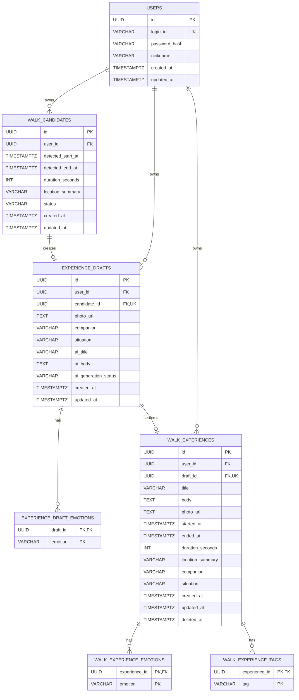

# ERD

## 1. 핵심 관계 요약

```
users 1 : 0..N walk_candidates
users 1 : 0..N experience_drafts
users 1 : 0..N walk_experiences

walk_candidates 1 : 0..1 experience_drafts
experience_drafts 1 : 0..1 walk_experiences

experience_drafts 1 : 0..N experience_draft_emotions
walk_experiences 1 : 0..N walk_experience_emotions
walk_experiences 1 : 0..N walk_experience_tags
```

- `users`는 로그인 인증, 마이페이지 사용자 정보, 산책 데이터 소유권의 기준 테이블입니다.
- Candidate 1개당 Draft는 없거나 최대 1개만 존재합니다.
- Draft 1개당 WalkExperience는 없거나 최대 1개만 존재합니다.
- Candidate → Draft 관계는 `experience_drafts.candidate_id`의 `FK + UNIQUE + NOT NULL`로 보장합니다.
- Draft → WalkExperience 관계는 `walk_experiences.draft_id`의 `FK + UNIQUE + NOT NULL`로 보장합니다.
- Draft/Experience에는 여러 감정이 존재할 수 있으며 별도의 대리키(`id`) 없이 복합 PK를 사용합니다.
    - `PRIMARY KEY (draft_id, emotion)`
    - `PRIMARY KEY (experience_id, emotion)`
- Experience에는 여러 태그가 존재할 수 있으며 별도의 대리키(`id`) 없이 `PRIMARY KEY (experience_id, tag)` 복합 PK를 사용합니다.
- `walk_candidates.user_id`, `experience_drafts.user_id`, `walk_experiences.user_id`는 동일한 사용자를 가리켜야 하며 소유권 일치는 백엔드 서비스 레이어에서 검증합니다.

---

# 2. Mermaid ERD 코드



> `PK`는 Primary Key, `FK`는 Foreign Key, `UK`는 UNIQUE Key를 의미합니다.
> 

### 복합 PK

다음 연결 테이블은 별도의 UUID 대리키를 생성하지 않습니다.

```
experience_draft_emotions
→ PRIMARY KEY (draft_id, emotion)

walk_experience_emotions
→ PRIMARY KEY (experience_id, emotion)

walk_experience_tags
→ PRIMARY KEY (experience_id, tag)
```

복합 PK 자체가 동일 부모 데이터 내 동일 감정·태그의 중복 저장을 방지하므로 별도의 `UNIQUE` 제약조건을 추가하지 않습니다.

> Mermaid 렌더링 환경에서 `PK, FK`와 같은 복합 Key 표기가 정상적으로 표시되지 않는 경우 Mermaid에는 `FK`만 표시하고, 실제 데이터베이스에서는 위 복합 PK 제약조건을 적용합니다.
> 

---

# 3. ERD 해석 설명

| 항목 | 설명 |
| --- | --- |
| `users → walk_candidates` | `walk_candidates.user_id`가 `users.id`를 `FK + NOT NULL`로 참조하여 Candidate의 소유 사용자를 구분합니다. |
| `users → experience_drafts` | `experience_drafts.user_id`가 `users.id`를 `FK + NOT NULL`로 참조하여 Draft의 소유 사용자를 구분합니다. |
| `users → walk_experiences` | `walk_experiences.user_id`가 `users.id`를 `FK + NOT NULL`로 참조하여 최종 Experience의 소유 사용자를 구분합니다. |
| `walk_candidates → experience_drafts` | `experience_drafts.candidate_id`가 `walk_candidates.id`를 `FK + UNIQUE + NOT NULL`로 참조하여 Candidate당 최대 하나의 Draft만 생성되도록 합니다. |
| `experience_drafts → walk_experiences` | `walk_experiences.draft_id`가 `experience_drafts.id`를 `FK + UNIQUE + NOT NULL`로 참조하여 Draft당 최대 하나의 WalkExperience만 생성되도록 합니다. |
| `experience_drafts → experience_draft_emotions` | `draft_id`가 Draft를 참조하고 `PRIMARY KEY(draft_id, emotion)`을 사용하여 하나의 Draft에 여러 감정을 저장하면서 동일 감정 중복을 방지합니다. |
| `walk_experiences → walk_experience_emotions` | `experience_id`가 Experience를 참조하고 `PRIMARY KEY(experience_id, emotion)`을 사용하여 하나의 Experience에 여러 감정을 저장하면서 동일 감정 중복을 방지합니다. |
| `walk_experiences → walk_experience_tags` | `experience_id`가 Experience를 참조하고 `PRIMARY KEY(experience_id, tag)`를 사용하여 하나의 Experience에 여러 태그를 저장하면서 동일 태그 중복을 방지합니다. |
| Snapshot 구조 | 시작·종료 시각, 지속 시간, 장소는 Candidate에서 Snapshot하고 제목·본문·사진·동반자·상황은 사용자의 최종 확인값으로 저장합니다. 감정과 태그도 각각 연결 테이블에 최종값을 Snapshot합니다. |
| 일반 조회 | 아카이브·상세·캘린더·태그 조회에서는 `experience_drafts`, `walk_candidates`를 JOIN하지 않고 최종 Experience와 감정·태그 테이블을 사용합니다. |
| 필수값 정책 | `walk_experiences.title`은 `NOT NULL`이고 최대 100자이며, `body`, `photo_url`, `companion`, `situation` 등의 선택 정보는 NULL을 허용합니다. |
| Soft Delete | `walk_experiences.deleted_at`에 삭제 시각을 저장합니다. 삭제된 Experience는 일반 목록·상세·수정 대상에서 제외합니다. |
| Draft 재확정 방지 | Soft Delete 이후에도 WalkExperience 행과 `draft_id` UNIQUE 제약이 유지되므로 동일 Draft에서 새로운 WalkExperience를 생성할 수 없습니다. |
| 사용자 정책 | `users`는 로그인·마이페이지·데이터 소유권의 기준 테이블이며 별도의 `profiles` 테이블을 생성하지 않습니다. |
| 회원가입 정책 | 회원가입은 MVP에서 제외하고 사전 생성된 테스트 계정을 사용합니다. |
| AI 추천 태그 | OpenAI의 `suggestedTags`는 DB에 저장하지 않으며 사용자가 최종 확인·수정한 태그만 `walk_experience_tags`에 저장합니다. |
| 별도 테이블 정책 | Calendar, Album, Notification, Push Token, Profile, Refresh Token 등의 별도 테이블은 MVP에서 생성하지 않습니다. |

---

# 4. 사용자 소유권 정합성

세 핵심 테이블은 각각 `user_id`를 보유합니다.

```
walk_candidates.user_id
        =
experience_drafts.user_id
        =
walk_experiences.user_id
```

다만 단순 FK만으로 위 세 값의 동일성을 직접 보장하는 것은 아니므로 백엔드 서비스 레이어에서 다음 규칙을 검증합니다.

### Candidate 생성

```
Access Token 사용자
        ↓
walk_candidates.user_id
```

`user_id`는 클라이언트 Request에서 받지 않고 서버가 인증 정보에서 설정합니다.

### Draft 생성

```
로그인 사용자
      =
walk_candidates.user_id
      =
experience_drafts.user_id
```

다른 사용자의 Candidate를 이용하여 Draft를 생성할 수 없습니다.

### WalkExperience 생성

```
로그인 사용자
      =
experience_drafts.user_id
      =
walk_experiences.user_id
```

다른 사용자의 Draft를 이용하여 최종 Experience를 생성할 수 없습니다.

---

# 5. 주요 코드값 및 제약조건

ERD 다이어그램에는 세부 CHECK를 모두 표현하지 않지만 실제 DB에서는 다음 제약조건을 사용합니다.

## Candidate Status

```
DETECTED
SUGGESTED
RECORDING
SKIPPED
```

```sql
CHECK (
    status IN (
        'DETECTED',
        'SUGGESTED',
        'RECORDING',
        'SKIPPED'
    )
)
```

---

## AI Generation Status

```
PENDING
GENERATING
SUCCESS
FAILED
```

```sql
CHECK (
    ai_generation_status IN (
        'PENDING',
        'GENERATING',
        'SUCCESS',
        'FAILED'
    )
)
```

AI 생성 상태가 `SUCCESS`이면 제목과 본문이 반드시 존재해야 합니다.

```sql
CHECK (
    ai_generation_status <> 'SUCCESS'
    OR (
        ai_title IS NOT NULL
        AND ai_body IS NOT NULL
    )
)
```

---

## Companion

```
ALONE
WITH_SOMEONE
PET
```

`experience_drafts`, `walk_experiences`에 동일한 CHECK 제약조건을 적용합니다.

---

## Emotion

```
CALM
HAPPY
TIRED
REFRESHED
PENSIVE
```

`experience_draft_emotions`, `walk_experience_emotions`에 동일한 CHECK 제약조건을 적용합니다.

---

## Situation

```
MORNING
AFTERNOON
EVENING
IN_TRANSIT
EXPLORING
```

`experience_drafts`, `walk_experiences`에 동일한 CHECK 제약조건을 적용합니다.

---

# 6. 태그 구조

`walk_experience_tags`는 최종 확정된 태그를 저장합니다.

```
walk_experience_tags

experience_id UUID
tag           VARCHAR(50)

PRIMARY KEY (experience_id, tag)
```

### 태그 정책

- 별도의 `id` PK를 생성하지 않습니다.
- DB에는 `#` 없이 저장합니다.
- 한 태그의 최대 길이는 50자입니다.
- 빈 문자열 또는 공백만 존재하는 태그는 저장하지 않습니다.
- 동일 Experience에 동일 태그를 중복 저장할 수 없습니다.
- 하나의 Experience에는 최대 10개의 태그를 저장할 수 있습니다.
- 최대 10개 제한은 애플리케이션 레이어에서 검증합니다.
- AI의 `suggestedTags`는 저장하지 않습니다.
- 사용자가 확인·수정한 최종 태그만 저장합니다.
- 별도의 `tags` 마스터 테이블은 MVP에서 생성하지 않습니다.
- 별도의 `albums`, `album_experiences` 테이블도 생성하지 않습니다.

---

# 7. 캘린더 및 조회 구조

별도의 Calendar 테이블이나 날짜별 컬럼을 생성하지 않습니다.

```
walk_experiences.started_at
```

을 기준으로 년·월·일 조회를 수행합니다.

따라서 다음 컬럼은 생성하지 않습니다.

```
year
month
day
```

## 조회 인덱스

사용자별 날짜·캘린더 조회를 위해 다음 복합 인덱스를 MVP 우선 인덱스로 사용합니다.

```sql
CREATE INDEX idx_walk_experiences_user_started_at
ON walk_experiences (user_id, started_at);
```

- 서비스 캘린더 날짜 기준은 `Asia/Seoul`입니다.
- 일반 목록 조회는 `started_at DESC`를 기본 정렬로 사용합니다.
- `deleted_at IS NULL`인 Experience만 일반 조회 대상으로 사용합니다.

> 인덱스와 서비스 시간대는 ERD 관계 자체가 아니므로 Mermaid ERD에는 별도 Entity로 표현하지 않습니다.
> 

---

# 8. 주요 관계 구조

```
users
  │
  ├── 1 : 0..N walk_candidates
  │
  ├── 1 : 0..N experience_drafts
  │
  └── 1 : 0..N walk_experiences

walk_candidates
      │
      │ experience_drafts.candidate_id
      │ FK + UNIQUE + NOT NULL
      ▼
experience_drafts
      │
      ├── 1 : 0..N experience_draft_emotions
      │       └─ PK (draft_id, emotion)
      │
      │ walk_experiences.draft_id
      │ FK + UNIQUE + NOT NULL
      ▼
walk_experiences
      │
      ├── 1 : 0..N walk_experience_emotions
      │       └─ PK (experience_id, emotion)
      │
      └── 1 : 0..N walk_experience_tags
              └─ PK (experience_id, tag)
```

---

# 9. 전체 관계 정리

최종 핵심 생성 관계는 다음과 같습니다.

```
walk_candidates
→ experience_drafts
→ walk_experiences
```

두 단계 모두 **1 : 0..1 관계**이며 다음 제약조건으로 DB에서 직접 보장합니다.

```
experience_drafts.candidate_id
→ FK + UNIQUE + NOT NULL

walk_experiences.draft_id
→ FK + UNIQUE + NOT NULL
```

사용자는 다음 세 테이블의 소유자입니다.

```
users
├─ walk_candidates
├─ experience_drafts
└─ walk_experiences
```

각 테이블은 `user_id FK + NOT NULL`로 `users.id`를 참조합니다.

감정과 태그는 다중값이므로 별도 연결 테이블을 사용하며 대리키 없이 복합 PK를 적용합니다.

```
experience_draft_emotions
→ PK (draft_id, emotion)

walk_experience_emotions
→ PK (experience_id, emotion)

walk_experience_tags
→ PK (experience_id, tag)
```

`walk_experiences`는 생성 출처 추적과 중복 확정 방지를 위해 `draft_id`를 유지하지만, 아카이브·상세·캘린더·태그 조회에 필요한 정보는 Snapshot으로 자체 보존하므로 일반 사용자 조회 시 Draft와 Candidate에 의존하지 않습니다.

산책 경험 삭제는 `deleted_at`을 이용한 Soft Delete로 처리하며 삭제 이후에도 `draft_id` UNIQUE 제약을 유지하여 동일 Draft의 재확정을 방지합니다.

---

# 10. MVP ERD 범위

MVP에서 사용하는 테이블은 총 7개입니다.

| 구분 | 테이블 |
| --- | --- |
| 사용자 | `users` |
| 산책 후보 | `walk_candidates` |
| 경험 초안 | `experience_drafts` |
| Draft 감정 | `experience_draft_emotions` |
| 산책 경험 | `walk_experiences` |
| Experience 감정 | `walk_experience_emotions` |
| Experience 태그 | `walk_experience_tags` |

다음 테이블은 MVP에서 생성하지 않습니다.

- `profiles`
- `calendars`
- `albums`
- `album_experiences`
- 별도 `tags` 마스터 테이블
- `notifications`
- `push_tokens`
- `refresh_tokens`
- `sessions`
- 사진 전용 테이블
- 이동 경로 전용 테이블

플로팅 메뉴, 뒤로가기, Android/Web 배포 분기, 기기 권한, 산책 자동 감지 ON/OFF, 로컬 알림은 클라이언트 영역이므로 ERD에 별도 테이블이나 관계를 추가하지 않습니다.